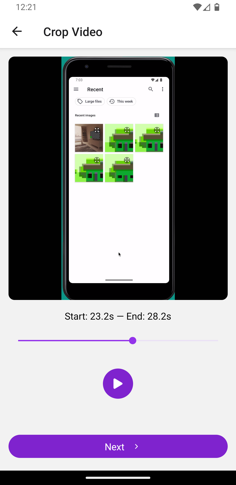
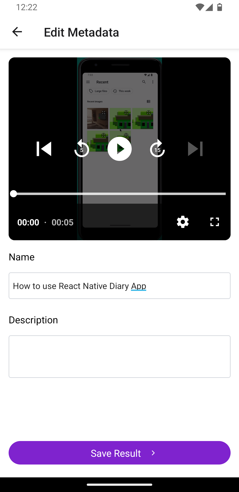
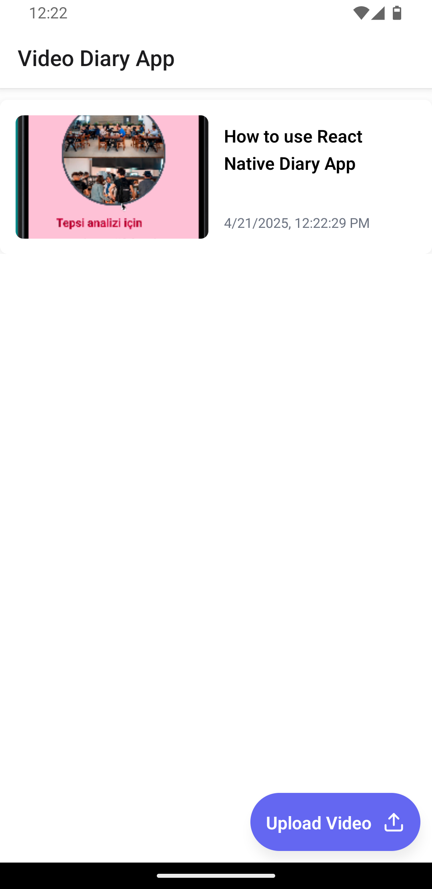
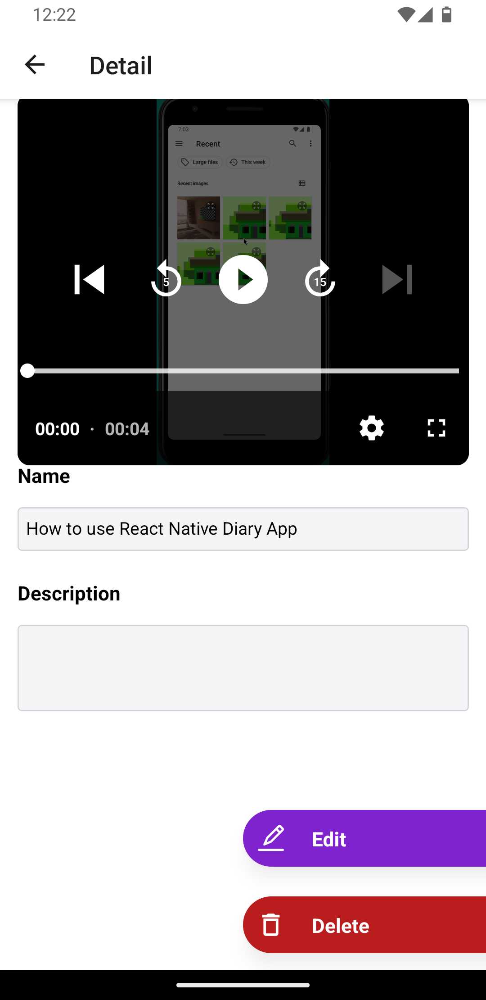

# React Native Video Diary App

## Features

• Import videos,
• Crop a specific segment of 5 seconds,
• Add details such as name and description to the video metadata,
• Save cropped videos to a list for future reference.

## Tech Stack

- React Native 0.76
- Expo 52
- Expo Router
- NativeWind
- FFMPEG (ffmpeg-kit-react-native)
- Zod
- Zustand
- Tanstack Query
- Expo Video
- AsyncStorage

## Installation

1. Clone the repository:

```bash 
git clone https://github.com/alperengozum/react-native-video-diary-app
```

2. Navigate to the project directory:

```bash
cd react-native-video-diary-app
```

3. Install dependencies:

```bash
yarn add
```

4. Start the development Android App:

```bash
yarn run android
```

5. Start the development iOS App:

```bash
yarn run ios
```

## How to Use
1. Open the app on your device or emulator.
2. Press the "Upload Video" button to select a video from your device."
3. Crop a specific segment of the video (5 seconds) with using slider.
4. Press play to preview the cropped video.
5. Press the "Next" button to add details such as name and description to the video metadata.
6. Press the "Save" button to save the cropped video to a list for future reference.
7. View the list of saved videos by navigating to the home screen.
8. Select a video from the list to view its details and play, delete or edit the video.

## Screenshots

<div style="display: grid; grid-template-columns: repeat(auto-fit, minmax(250px, 1fr)); gap: 20px;">
  
  
  
  
  
</div>
